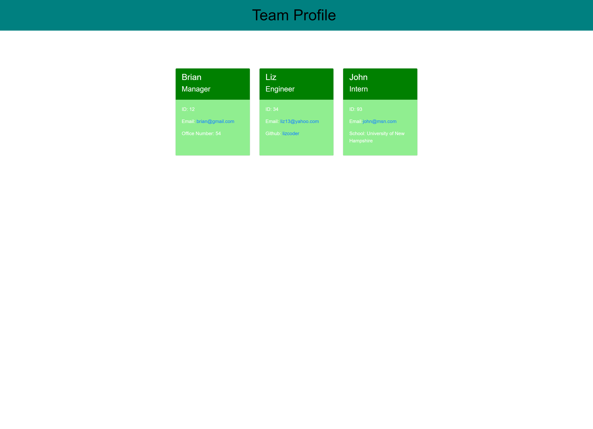

# <Workplace-Team-Profile_Gen>

## Description

Provide a short description explaining the what, why, and how of your project. Use the following questions as a guide:

- What was your motivation?
- Why did you build this project? (Note: the answer is not "Because it was a homework assignment.")
- What problem does it solve?
- What did you learn?

## Table of Contents (Optional)

- [Installation](#installation)
- [Usage](#usage)
- [Credits](#credits)
- [License](#license)

## Installation

You can copy the repo from https://github.com/DylanB0905/Workplace-Team-Profile_Gen

## Usage
Open up an integrated terminal. Then you want to type node index.js. Once you have done that you need to answer all the questions and once you're done your generated html file will be in the dist folder.

    
   
## Video of Usage

[Walkthrough Video](https://www.youtube.com/watch?v=YeC0KMgA1t0)

## Credits
inquirer: https://www.npmjs.com/package/inquirer
jest: https://jestjs.io/

## License

MIT License

---

## How to Contribute
The [Contributor Covenant](https://www.contributor-covenant.org/) 

